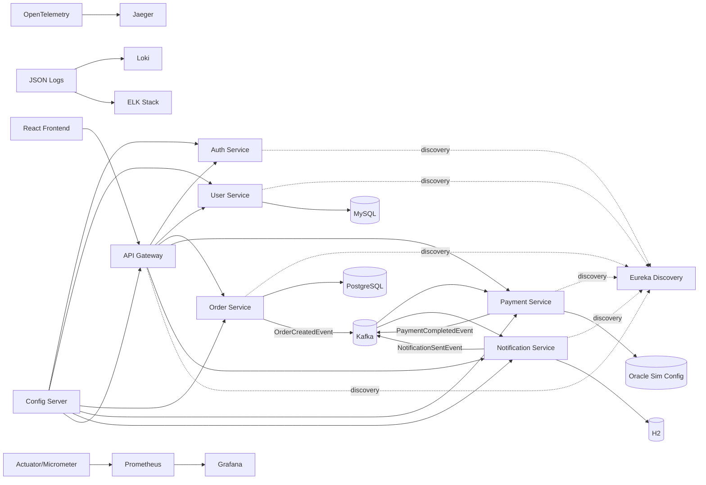
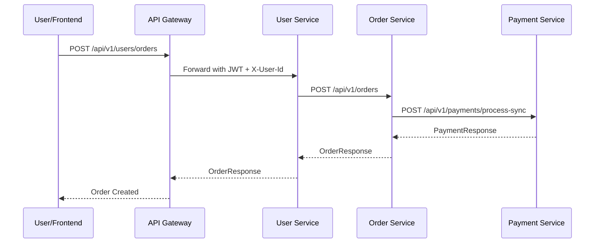
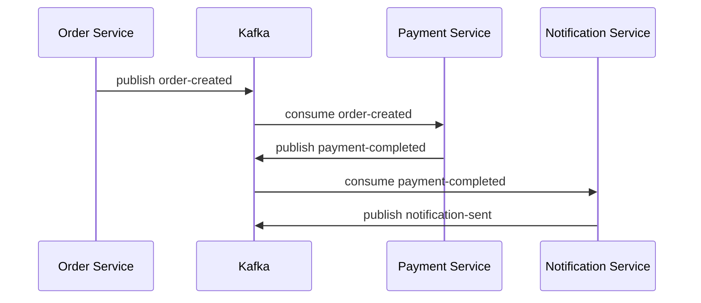

# Educational Microservices Demo Platform

Enterprise training platform showcasing API-first microservices with synchronous and asynchronous communication, observability, resiliency, and platform engineering patterns.

## Tech Stack
- Backend: Java 25, Spring Boot 4.0.3, Spring Cloud, Eureka, Gateway, Resilience4j, Actuator, Micrometer, OpenTelemetry
- Databases: MySQL (user), PostgreSQL (order), Oracle simulation config (payment), H2 (auth/notification/local)
- Messaging: Kafka
- Frontend: React 19 + Vite + Axios + Tailwind
- Observability: Prometheus, Grafana, Loki, ELK, Jaeger
- Infra: Docker, Docker Compose, Kubernetes
- Testing: JUnit 5, Mockito, Testcontainers

## Repository Structure
```text
root
+-- api-gateway
+-- discovery-server
+-- config-server
+-- auth-service
+-- user-service
+-- order-service
+-- payment-service
+-- notification-service
+-- frontend
+-- infrastructure
¦   +-- config-repo
+-- docker
+-- kubernetes
```

## Architecture Diagram


## Service Communication Flow
### Synchronous (REST)


### Asynchronous (Kafka)


## API Highlights
- Auth
  - `POST /api/v1/auth/register`
  - `POST /api/v1/auth/login`
  - `POST /api/v1/auth/validate`
  - `POST /api/v2/auth/login` (version demo)
- Products
  - `GET /api/v1/products`
  - `GET /api/v2/products` (adds stock/currency)
- Orders
  - `POST /api/v1/users/orders` (via user-service)
  - `GET /api/v1/orders/{id}`
- Payment fault simulation
  - `POST /api/payment/fail`
  - `POST /api/payment/recover`

## Security
- JWT is generated by `auth-service` and validated in `api-gateway`
- Gateway applies:
  - auth filter
  - request logging
  - in-memory rate limiting (100 requests/min/user)

## Resilience Patterns in Order Service
- Circuit Breaker: `paymentService`
- Retry: `paymentService`
- Timeout: `paymentService` time limiter (2s)
- Bulkhead: semaphore bulkhead
- Fallback status: `FALLBACK_PENDING`

## Observability
- Actuator endpoints on all services:
  - `/actuator/health`
  - `/actuator/metrics`
  - `/actuator/prometheus`
- Prometheus scrapes services
- Grafana dashboard: request throughput, error rate, JVM memory
- Traces exported to Jaeger
- Structured JSON logs for Loki and ELK

## Run Locally (without Docker)
1. Start infrastructure dependencies (MySQL, PostgreSQL, Kafka, Jaeger).
2. Run services in this order:
   1. `discovery-server`
   2. `config-server`
   3. `api-gateway`
   4. `auth-service`
   5. `user-service`
   6. `order-service`
   7. `payment-service`
   8. `notification-service`
3. Start frontend:
   1. `cd frontend`
   2. `npm install`
   3. `npm run dev`

## Run with Docker Compose
1. Build and start everything:
   1. `cd docker`
   2. `docker compose up --build`
2. Access:
   - Frontend (dev mode separately): `http://localhost:5173`
   - Gateway: `http://localhost:8080`
   - Eureka: `http://localhost:8761`
   - Prometheus: `http://localhost:9090`
   - Grafana: `http://localhost:3000`
   - Kibana: `http://localhost:5601`
   - Jaeger: `http://localhost:16686`

## Kubernetes Deployment
1. Create namespace:
   1. `kubectl apply -f kubernetes/namespace.yaml`
2. Apply all services:
   1. `kubectl apply -f kubernetes/discovery-server`
   2. `kubectl apply -f kubernetes/config-server`
   3. `kubectl apply -f kubernetes/auth-service`
   4. `kubectl apply -f kubernetes/user-service`
   5. `kubectl apply -f kubernetes/order-service`
   6. `kubectl apply -f kubernetes/payment-service`
   7. `kubectl apply -f kubernetes/notification-service`
   8. `kubectl apply -f kubernetes/api-gateway`
   9. `kubectl apply -f kubernetes/ingress.yaml`
3. Autoscaling demo:
   1. `kubectl apply -f kubernetes/order-service/hpa.yaml`

## Fault Tolerance Demo Steps
1. Login and place a normal order.
2. Trigger payment failure:
   1. `POST /api/payment/fail`
3. Place more orders and observe:
   - retries
   - circuit breaker transitions
   - fallback responses (`FALLBACK_PENDING`)
4. Recover payment:
   1. `POST /api/payment/recover`

## Logs and Metrics
- Loki: query logs by `job=varlogs`
- Kibana: index `microservices-logs`
- Prometheus metrics: `http_server_requests_seconds_count`
- Jaeger: inspect traces for `order-service` and `payment-service`

## Notes for Trainers
- Config is centralized in `infrastructure/config-repo`.
- API versioning is shown in `auth-service` and `user-service`.
- Load-balancing can be demonstrated by scaling `order-service` replicas in Docker/Kubernetes.
- Oracle is intentionally simulated via configuration to keep local setup lightweight.
